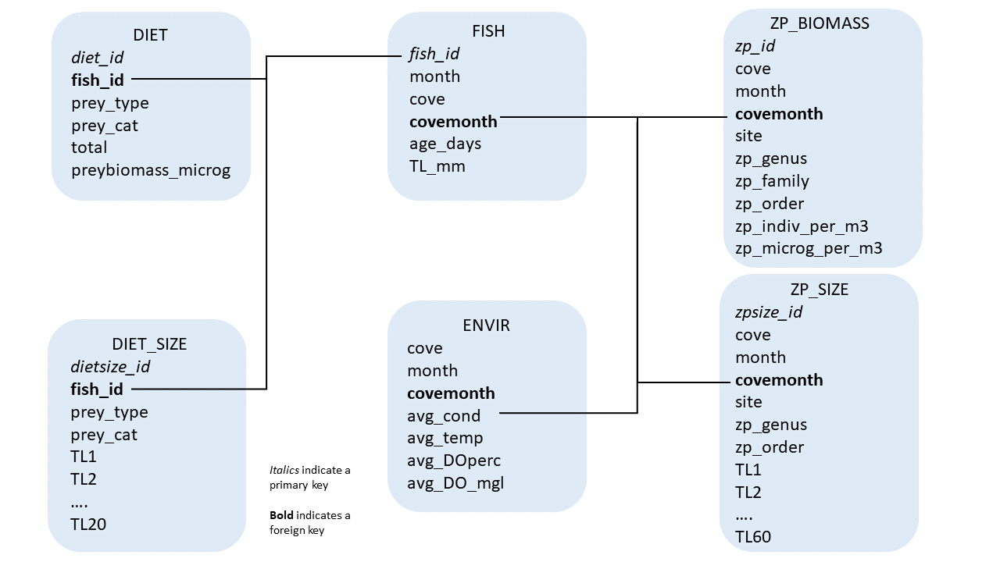

# Database Creation 

A variety of data was collected for this project; including data specific to individual juvenile river herring, gut content information for each of those fish, specific measurements for individual gut content items, environmental data, zooplankton samples, and specific measurements for individual zooplankton. To better organize and store this data, I have created a database using R and SQL (Figure 2.1).

```{r image, fig.cap="Schematic of database design", fig.align='center', out.width='100%', echo=FALSE}

```

To recreate this database, simply execute the code below. Note, each table is referred to by the title provided to each box in the above figure.

## Load required package and initate database building

Load the DBI package into R and initiate a connection between R and SQLite by creating the database file.

```{r, warning=FALSE, eval=FALSE}
library(DBI)

#Create Database ----
rh_db <- dbConnect(RSQLite::SQLite(), "../DataClean/rh.db")
```


## Create **FISH** table

The fish table includes the following data: fish_id (*primary key*), month captured, cove captured at, covemonth combination (**foreign key**), fish age in days, and TL in mm.

```{r,eval=FALSE}

##Create fish table in sql
dbExecute(rh_db, "CREATE TABLE fish (
fish_id char(5) NOT NULL,
cove varchar(12) CHECK (cove IN ('chapman', 'wethersfield', 'hamburg')),
month varchar(10) CHECK (month IN ('July', 'August', 'September')),
covemonth varchar(22) CHECK (covemonth IN ('hamburgAugust', 'hamburgJuly', 
  'wethersfieldJuly', 'wethersfieldAugust', 'wethersfieldSeptember', 'chapmanJuly', 
  'chapmanAugust', 'chapmanSeptember')),
age_days integer(2),
TL_mm integer(2),
PRIMARY KEY (fish_id)
);")

##Load fish csv into R
fish <- read.csv("../DataClean/Fish.csv",
                 stringsAsFactors = FALSE)

##Check that names align
names(fish)

##Write loaded csv into sql table
dbWriteTable(rh_db, "fish", fish, append = TRUE)

##Check that data loaded properly
dbGetQuery(rh_db, "SELECT * FROM fish LIMIT 3;")

```

## Create **ENVIR** table

The envir table includes the following data: covemonth (*primary key*), month, cove, average conductivity (avg_cond), average temperature in celsius (avg_temp), average percent dissolved oxygen (avg_DOperc), and average milligrams of dissolved oxygen per liter of water (avg_DOmgl). These are averages of measurements taken over a range of water depths.

```{r,eval=FALSE}

##Create envir table in sql
dbExecute(rh_db, "CREATE TABLE envir (
cove varchar(12) CHECK (cove IN ('chapman', 'wethersfield', 'hamburg')),
month varchar(10) CHECK (month IN ('June', 'July', 'August', 'September')),
covemonth varchar(22) NOT NULL PRIMARY KEY CHECK (covemonth IN ('hamburgAugust', 'hamburgJuly', 
  'hamburgJune', 'hamburgSeptember', 'wethersfieldJune',  'wethersfieldJuly', 
  'wethersfieldAugust', 'wethersfieldSeptember', 'chapmanJune', 'chapmanJuly', 
  'chapmanAugust', 'chapmanSeptember')),
avg_cond real,
avg_temp real,
avg_DOperc real,
avg_DOmgl real
);")

##Load fish csv into R
envir <- read.csv("../DataClean/Envir.csv",
                 stringsAsFactors = FALSE)

##Check that names align
names(envir)

##Write loaded csv into sql table
dbWriteTable(rh_db, "envir", envir, append = TRUE)

##Check that data loaded properly
dbGetQuery(rh_db, "SELECT * FROM envir LIMIT 3;")

```

## Create **DIET** table

The diet table includes the following data: diet_id (*primary key*), fish_id (**foreign key**), lowest possible taxonomic classification of prey (prey_type), prey Order (prey_cat), total number of that type of prey found in the fish, and total biomass (micrograms) of that type of prey found in the fish.

```{r,eval=FALSE}

##Create diet table in sql
dbExecute(rh_db, "CREATE TABLE diet (
diet_id char(7) PRIMARY KEY NOT NULL,
fish_id char(5),
prey_type varchar(20),
prey_cat varchar(20),
total integer(3),
preybiomass_microg double,
FOREIGN KEY (fish_id) REFERENCES fish(fish_id)
);")

##Load diet csv into R
diet <- read.csv("../DataClean/Diet.csv",
                 stringsAsFactors = FALSE)

##Check that names align
names(diet)

##Write loaded csv into sql table
dbWriteTable(rh_db, "diet", diet, append = TRUE)

##Check that data loaded properly
dbGetQuery(rh_db, "SELECT * FROM diet LIMIT 3;")

```

## Create **DIET_SIZE** table

The diet_size table includes the following data: dietsize_id (*primary key*), fish_id (**foreign key**), lowest possible taxonomic classification of prey (prey_type), prey Order (prey_cat), and the total length (micrometers) of the first twenty individuals of that prey type identified in a fish.

```{r,eval=FALSE}

##Create diet_size table in sql
dbExecute(rh_db, "CREATE TABLE diet_size (
dietsize_id char(11) PRIMARY KEY NOT NULL,
fish_id char(5),
prey_tot double,
prey_type varchar(20),
prey_cat varchar(20),
TL1 double,
TL2 double,
TL3 double,
TL4 double,
TL5 double,
TL6 double,
TL7 double,
TL8 double,
TL9 double,
TL10 double,
TL11 double,
TL12 double,
TL13 doulbe,
TL14 double,
TL15 double,
TL16 double,
TL17 double,
TL18 double,
TL19 double,
TL20 double,
FOREIGN KEY (fish_id) REFERENCES fish(fish_id)
);")

##Load diet_size csv into R
diet_size <- read.csv("../DataClean/Diet_Size.csv",
                 stringsAsFactors = FALSE)

##Check that names align
names(diet_size)

##Write loaded csv into sql table
dbWriteTable(rh_db, "diet_size", diet_size, append = TRUE)

##Check that data loaded properly
dbGetQuery(rh_db, "SELECT * FROM diet_size LIMIT 3;")

```

## Create **ZP_BIOMASS** table

The zp_biomass table includes the following data: zp_id (*primary key*), cove, month, covemonth(**foreign key**), sampling site (approximately three unique sites were sampled at each cove, each month), zooplankton genus, zooplankton family, zooplankton order, the number of individual zooplankton per cubic meter of water, and the biomass of zooplankton (micrograms) per cubic meter of water. 

```{r,eval=FALSE}

##Create zp_biomass table in sql
dbExecute(rh_db, "CREATE TABLE zp_biomass (
zp_id char(5) PRIMARY KEY NOT NULL,
cove varchar(12) CHECK (cove IN ('chapman', 'wethersfield', 'hamburg')),
month varchar(10) CHECK (month IN ('June', 'July', 'August', 'September')),
covemonth varchar(22) CHECK (covemonth IN ('hamburgAugust', 'hamburgJuly', 
  'hamburgJune', 'hamburgSeptember', 'wethersfieldJune',  'wethersfieldJuly', 
  'wethersfieldAugust', 'wethersfieldSeptember', 'chapmanJune', 'chapmanJuly', 
  'chapmanAugust', 'chapmanSeptember')),
site integer(1),
zp_order varchar(20),
zp_family varchar(20),
zp_genus varchar(20),
zp_indiv_per_m3 double,
zp_microg_per_m3 double,
FOREIGN KEY (covemonth) REFERENCES envir(covemonth)
);")

##Load diet csv into R
zp_biomass <- read.csv("../DataClean/ZP_Biomass.csv",
                 stringsAsFactors = FALSE)

##Check that names align
names(zp_biomass)

##Write loaded csv into sql table
dbWriteTable(rh_db, "zp_biomass", zp_biomass, append = TRUE)

##Check that data loaded properly
dbGetQuery(rh_db, "SELECT * FROM zp_biomass LIMIT 3;")

```

## Create **ZP_SIZE** table

The zp_size table includes the following data: zpsize_id (*primary key*), cove, month, covemonth(**foreign key**), sampling site (approximately three unique sites were sampled at each cove, each month), lowest possible taxonomic classification of zooplankton (zp_type), zooplankton order,and the total length (micrometers) of the first twenty individuals  of that zooplankton identified at each site at each covemonth combination.

```{r,eval=FALSE}

##Create zp_size table in sql
dbExecute(rh_db, "CREATE TABLE zp_size (
zpsize_id char(8) PRIMARY KEY NOT NULL,
cove varchar(12) CHECK (cove IN ('chapman', 'wethersfield', 'hamburg')),
month varchar(10) CHECK (month IN ('June', 'July', 'August', 'September')),
covemonth varchar(22) CHECK (covemonth IN ('hamburgAugust', 'hamburgJuly', 
  'hamburgJune', 'hamburgSeptember', 'wethersfieldJune',  'wethersfieldJuly', 
  'wethersfieldAugust', 'wethersfieldSeptember', 'chapmanJune', 'chapmanJuly', 
  'chapmanAugust', 'chapmanSeptember')),
site integer(1),
zp_type varchar(20),
zp_order varchar(20),
TL1 double,
TL2 double,
TL3 double,
TL4 double,
TL5 double,
TL6 double,
TL7 double,
TL8 double,
TL9 double,
TL10 double,
TL11 double,
TL12 double,
TL13 doulbe,
TL14 double,
TL15 double,
TL16 double,
TL17 double,
TL18 double,
TL19 double,
TL20 double,
TL21 double,
TL22 double,
TL23 double,
TL24 double,
TL25 double,
TL26 double,
TL27 double,
TL28 double,
TL29 double,
TL30 double,
TL31 double,
TL32 double,
TL33 double,
TL34 double,
TL35 double,
TL36 double,
TL37 double,
TL38 double,
TL39 double,
TL40 double,
TL41 double,
TL42 double,
TL43 double,
TL44 double,
TL45 double,
TL46 double,
TL47 double,
TL48 double,
TL49 double,
TL50 double,
TL51 double,
TL52 double,
TL53 double,
TL54 double,
TL55 double,
TL56 double,
TL57 double,
TL58 double,
TL59 double,
TL60 double,
FOREIGN KEY (covemonth) REFERENCES envir(covemonth)
);")

##Load diet_size csv into R
zp_size <- read.csv("../DataClean/ZP_Size.csv",
                      stringsAsFactors = FALSE)

zp_size[zp_size == ''] <- NA

##Check that names align
names(zp_size)

##Write loaded csv into sql table
dbWriteTable(rh_db, "zp_size", zp_size, append = TRUE)

##Check that data loaded properly
dbGetQuery(rh_db, "SELECT * FROM zp_size LIMIT 3;")

```

