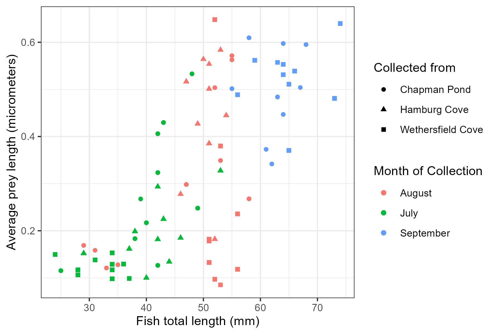
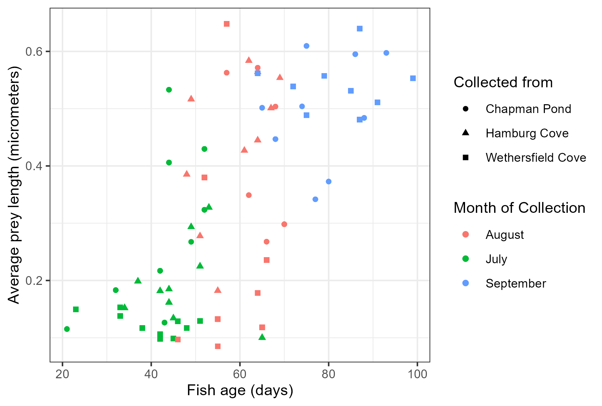
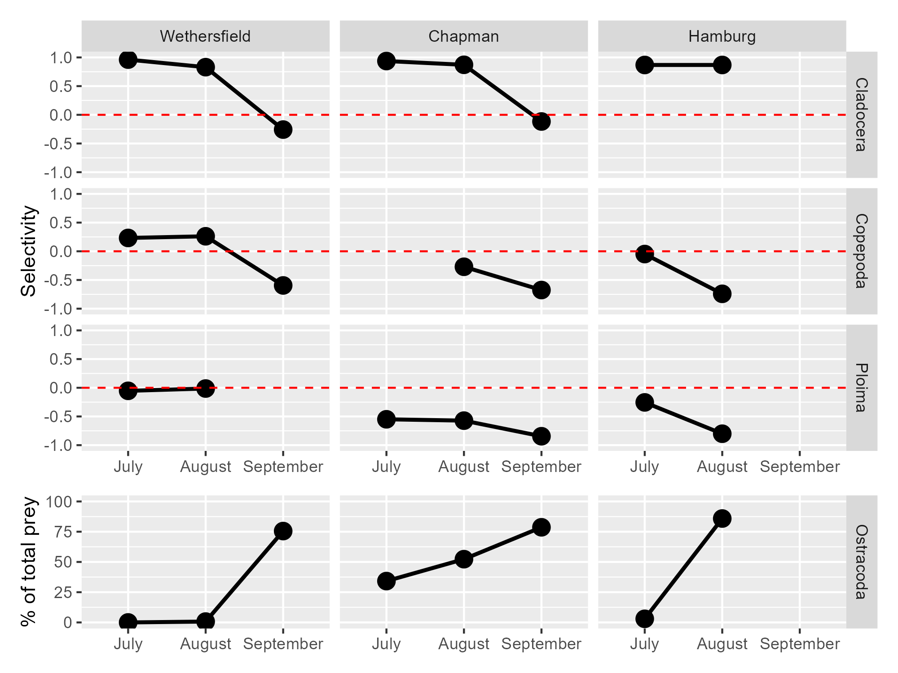

# Data Visualizations 

## Scatterplots, fish and prey

### Use ggplot to create a scatterplot of average prey length by fish length

```{r, warning=FALSE, eval=FALSE}

library(patchwork)

ggplot(avgfishpreylength, aes(x = TL_mm, y = fishavgpreylength, 
                                    color = month, shape = cove)) +
  geom_point() +
  theme_bw() +
  labs(x = "Fish total length (mm)", y = "Average prey length (micrometers)",
       color = "Month of Collection", shape =  "Collected from") +
  scale_shape_discrete(labels = c("Chapman Pond",
                                  "Hamburg Cove",
                                  "Wethersfield Cove"))

```
```{r, warning=FALSE, eval=FALSE, include = FALSE}
ggsave("fishpreysize.png", width = 1780, height = 1200, units = "px",
       dpi = 300)
```


```{r image3, fig.align='center', out.width='100%', echo=FALSE}

```

### Use ggplot to create a scatterplot of average prey length by fish age

```{r, warning=FALSE, eval=FALSE}

ggplot(avgfishpreylength, aes(x = age_days, y = fishavgpreylength, 
                                    color = month, shape = cove)) +
  geom_point() +
  theme_bw() +
  labs(x = "Fish age (days)", y = "Average prey length (micrometers)",
       color = "Month of Collection", shape =  "Collected from") +
  scale_shape_discrete(labels = c("Chapman Pond",
                                  "Hamburg Cove",
                                  "Wethersfield Cove"))

```

```{r, warning=FALSE, eval=FALSE, include = FALSE}
ggsave("agepreysize.png", width = 1780, height = 1200, units = "px",
       dpi = 300)
```

```{r image5, fig.align='center', out.width='100%', echo=FALSE}

```

## Selectivity plot

### Use ggplot to create a graph of selectivity of different prey categories across months and sites

```{r, warning=FALSE, eval=FALSE}

pd <- position_dodge(.15)
capsites_o <- c('wethersfield' = "Wethersfield", 'chapman' = "Chapman", 
              'hamburg' = "Hamburg", 'Ostracoda' = "Ostracoda")

capsites_z <- c('wethersfield' = "Wethersfield", 'chapman' = "Chapman", 
              'hamburg' = "Hamburg", 'Cladocera' = "Cladocera", 
              'Copepoda' = "Copepoda", 'Ploima' = "Ploima")

p1 <- ggplot(zpwcgcwide, aes(x = month, y = selectivity)) +
  geom_line( aes(group = category), size = 1, position = pd) +
  geom_point(position = pd, size = 4) +
  geom_hline(aes(yintercept = 0), color = "red", linetype = "dashed") +
  coord_cartesian(ylim = c(-1,1)) +
  labs(y = "Selectivity", x = NULL) +
  facet_grid("category~cove", labeller = as_labeller(capsites_z))

p2 <- ggplot(ostra, aes(x = month, y = actperc)) +
  geom_line( aes(group = category), size = 1, position = pd) +
  geom_point(position = pd, size = 4) +
  coord_cartesian(ylim = c(0,100)) +
  labs(y = "% of total prey", x = NULL) +
  facet_grid("category~cove", labeller = as_labeller(capsites_o))+
  theme(strip.text.x = element_blank(), strip.background.x = element_blank())

p1 / p2 + plot_layout(heights = c(3,1))

```
```{r, warning=FALSE, eval=FALSE, include = FALSE}
ggsave("selectivity.png", width = 2000, height = 1500, units = "px",
       dpi = 300)
```


```{r image4, fig.align='center', out.width='100%', echo=FALSE}

```
