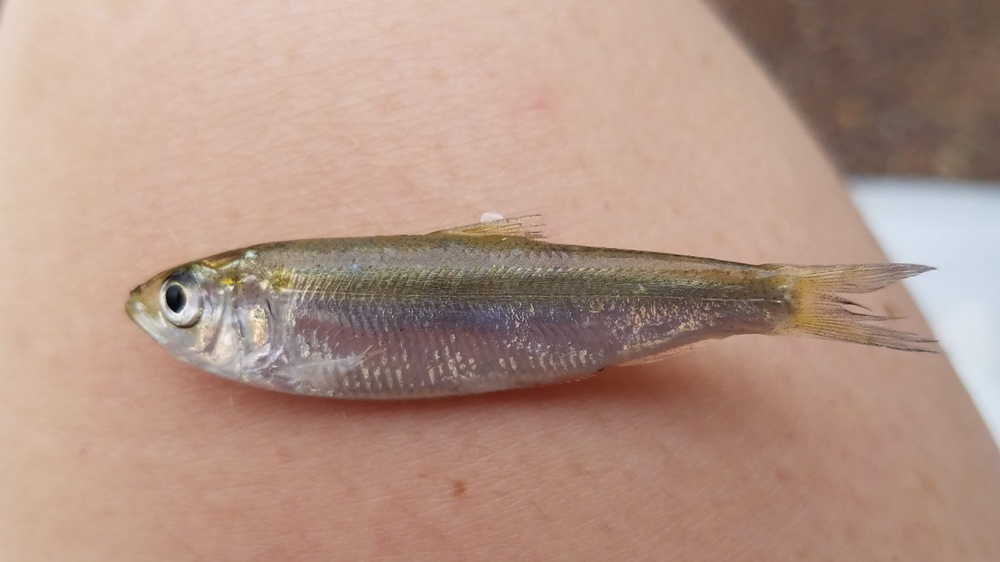

--- 
title: "Juvenile River Herring: Diet, habitat, and food resources from the Connecticut River"
author: "Meghan Slocombe"
date: "`r Sys.Date()`"
site: bookdown::bookdown_site
documentclass: book
bibliography: [book.bib, packages.bib]
# url: your book url like https://bookdown.org/yihui/bookdown
# cover-image: path to the social sharing image like images/cover.jpg
description: |
  This is a website for Meghan Slocombe's honors thesis completed in 2020 at the University of Massachusetts Amherst.
  
link-citations: yes
github-repo: rstudio/bookdown-demo
---

# Juvenile river herring

River herring (alewife Alosa pseudoharengus and blueback herring A. aestivalis) are anadromous fish and juveniles feed on zooplankton during their residence in freshwater (Figure 1.1). In lakes with high densities of planktivores, juvenile river herring can deplete food resources. These shifting zooplankton densities may influence the growth, health, and emigration timing of juvenile river herring. However, these relationships are not yet fully understood. 
  This research aims to clarify the relationship between juvenile river herring and zooplankton through targeted sampling of three freshwater coves along the Connecticut River. The coves were stratified along the southern portion of the Connecticut river, with Hamburg Cove closest to the mouth, Chapman Pond in the middle, and Wethersfield Cove the furthest upstream. Once per month (June-September of 2019), a combination of juvenile river herring, zooplankton samples, and environmental data were collected. This website provides information on data cleaning, database building, and data analysis. Please [email](mailto:slocombemg@gmail.com) Meghan-Grace Slocombe with any questions.
  
```{r image1, fig.cap="Juvenile river herring", fig.align='center', out.width='100%', echo=FALSE}

```

## Institution 

This research was conducted at the University of Massachusetts Amherst to fulfill the honors thesis requirement.

## Study Sites

The study sites were Hamburg Cove, Chapman Pond, and Wethersfield Cove (Figure 1.2).

```{r image2, fig.cap="Map of sampled coves along the Connecticut River, oriented with North at the top", fig.align='center', out.width='70%', echo=FALSE}
knitr::include_graphics("Map.png")
```
